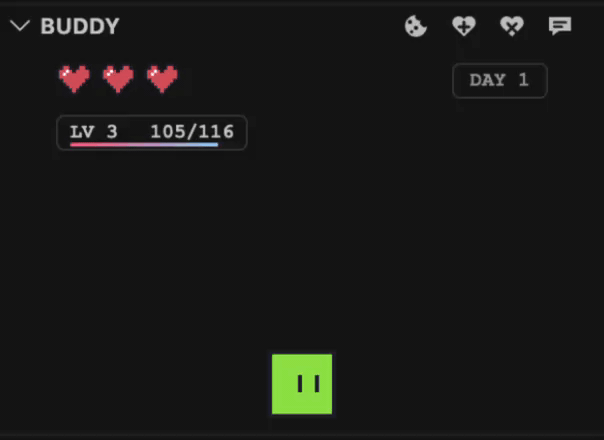

# Buddy

An animated IDE companion for VS Code that reacts to your coding flow from the Activity Bar.

[](CHANGELOG.md)
[](https://code.visualstudio.com/)
[](LICENSE)

## Preview

<p align="left">
  
</p>

Buddy is local-first, lightweight, and built to add a little personality to focused work.

## Table of Contents

- [Preview](#preview)
- [Features](#features)
- [Installation](#installation)
- [Using Buddy](#using-buddy)
- [Commands](#commands)
- [Development](#development)
- [License](#license)

## Features

- Animated sidebar companion with idle, typing, searching, thinking, sleeping, happy, and jump states.
- First-open spawn animation with a Buddy greeting and heart reveal.
- Three-heart health meter with one heart lost every three local wall-clock hours, cookie and sandwich feeding to recover, cake-granted gold heart shields, and a floating soul when Buddy dies.
- Persistent alive day counter that scrambles into place and only resets after Buddy dies.
- Persistent XP counter with levels up to 100, including progress bursts for saves, feeding, commits, successful terminal `git push` work, and level-scaled XP loss when Buddy dies.
- Automatic coffee drops every five Git commits detected by VS Code.
- Gentle attention meter below Buddy's level and XP that drops across an 8-hour workday and refills from care actions.
- Locally saved level-up card PNGs when Buddy levels up while the panel is open.
- Dash behavior when Buddy goes after treats.
- Command-click panel cookie drops so Buddy eats at the spot you choose.
- Double-click panel movement so Buddy walks or dashes to the spot you choose.
- Cursor-aware look sprites when your pointer gets close to Buddy.
- Speech bubbles for break reminders, heart loss, and cookie eating, with scrambled text that decodes into Buddy's message.
- Editor-aware reactions while you write, navigate, save, and run terminal commands.
- Feed Buddy cookies, coffee, sandwiches, and cake for different care rewards.
- Command Palette controls for showing Buddy, previewing animations, and testing states.

## Installation

### Install from VS Code Marketplace

Install Buddy from the [VS Code Marketplace](https://marketplace.visualstudio.com/items?itemName=connor-partington.buddy-ide-companion).

### Install manually

Download the latest `.vsix` package from the [GitHub releases](https://github.com/Connor-Partington/buddy/releases), then install it from VS Code:

1. Open the Extensions view.
2. Choose `Install from VSIX...` from the `...` menu.
3. Select the Buddy `.vsix` file.
4. Run `Developer: Reload Window` if the Activity Bar does not refresh immediately.

## Using Buddy

After installing Buddy, open the Command Palette:

```text
Ctrl+Shift+P on Windows/Linux
Cmd+Shift+P on macOS
```

Run `Buddy: Show Sidebar` to open the Buddy view from the Activity Bar. Buddy will wake up in the sidebar and react as you edit, navigate, save, or run terminal commands.

Buddy tracks the current life across sessions with a day counter in the panel. The counter scrambles into place, keeps going while Buddy is alive, and restarts from Day 1 after Buddy has died and been revived.

Buddy also tracks XP across sessions. Saving a supported local file earns 1 XP, feeding Buddy earns 5 XP, coffee activates a 2x XP multiplier for 30 minutes, Git commits detected by VS Code earn 20 XP, and a successful push from the integrated terminal earns 30 XP. Every fifth detected Git commit also drops coffee for Buddy. Commits made from the Source Control panel count because Buddy listens to VS Code's built-in Git repository state. Each level needs more XP than the previous level, with the level 100 cap tuned to about 85,000 total XP. If Buddy dies, he loses 25% of the XP requirement for his current level, which can drop him to a lower level when his current XP is low enough. When Buddy levels up while the panel is open, Buddy saves a local PNG level-up card and offers to open it.

Buddy's attention meter is a softer daily care goal, not a life-or-death need. It drops from full to empty across about 8 hours when Buddy has not received attention and refills when you feed Buddy, tap him for love, or double-click the panel to make him chase to a spot. When attention gets low, Buddy may give a friendly reminder in a speech bubble.

Treats have distinct effects: cookies restore one red heart, sandwiches refill missing red hearts, cake grants up to two gold heart shields after the three red hearts, and coffee gives Buddy an XP boost. Coffee can be spawned manually or dropped automatically after every five detected Git commits. Timed heart loss consumes gold hearts before red hearts.

## Actions

- Command-click inside the Buddy panel to drop a cookie at that spot.
- Use the  icon in the Buddy panel title bar to feed Buddy.
- Use the  icon in the Buddy panel title bar to revive Buddy.
- Use the  icon in the Buddy panel title bar to kill Buddy.
- Use the  icon in the Buddy panel title bar to toggle the break prompt.

## Commands

| Command | What it does |
| --- | --- |
| `Buddy: Show Sidebar` | Opens the Buddy Activity Bar view. |
| `Buddy: Wake Up` | Returns Buddy to the idle state. |
| `Buddy: Preview Animations` | Cycles through Buddy's animation states. |
| `Buddy: Spawn Cookie` | Drops a cookie for Buddy to walk over, eat, and recover a heart. |
| `Buddy: Spawn Coffee` | Drops coffee for Buddy to walk over, drink, and gain bonus XP. |
| `Buddy: Spawn Sandwich` | Drops a sandwich for Buddy to walk over, eat, and refill missing red hearts. |
| `Buddy: Spawn Cake` | Drops cake for Buddy to walk over, eat, and gain a gold heart shield. |
| `Buddy: Toggle Break Prompt` | Shows or hides Buddy's break reminder speech bubble. |
| `Buddy: Remove Heart` | Removes one heart for testing death and revive behavior. |
| `Buddy: Add XP` | Adds 25 XP for testing the XP counter and burst animation. |
| `Buddy: Reset XP` | Resets Buddy's XP progress to level 1. |
| `Buddy: Run Feature Demo` | Opens the Buddy sidebar and runs the automated recording demo sequence. |
| `Buddy: Set XP Multiplier` | Changes the persisted XP multiplier for future XP gains. |
| `Buddy: Kill` | Drains all hearts to trigger Buddy's death state. |
| `Buddy: Revive` | Plays Buddy's revive animation and restores three hearts after death. |
| `Buddy: Toggle Size` | Switches Buddy between default and small sizes. |
| `Buddy: Set State Idle` | Shows the idle state. |
| `Buddy: Set State Typing` | Shows the typing state. |
| `Buddy: Set State Searching` | Shows the searching state. |
| `Buddy: Set State Thinking` | Shows the thinking state. |
| `Buddy: Set State Sleeping` | Shows the sleeping state. |
| `Buddy: Set State Happy` | Shows the happy state. |
| `Buddy: Set State Jump` | Shows the jump state. |

## Development

Install dependencies:

```bash
npm install
```

Run Buddy in an Extension Development Host:

```text
Press F5 in VS Code
```

Keep TypeScript compiling in the background:

```bash
npm run watch
```

Before sharing a build, compile and package a VSIX:

```bash
npm run compile
npm run package
```

Install or update that VSIX locally with the VS Code CLI:

```bash
code --install-extension buddy-ide-companion-0.5.0.vsix --force
```

To record Buddy's core feature loop, start recording the Extension Development Host window, then run this from the repo terminal:

```bash
npm run demo
```

The demo opens the Buddy sidebar and automatically runs through state changes, one-heart loss, cookie recovery, the break prompt, XP bursts, death, and revive. Keep the Extension Development Host open while it plays.

## License

GNU Lesser General Public License v2.0
