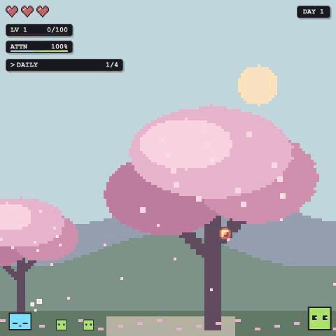

# Buddy

An animated IDE companion for VS Code that reacts to your coding flow from the Activity Bar.

[](CHANGELOG.md)
[](https://code.visualstudio.com/)
[](LICENSE)

## Preview

<p align="left">
  
</p>

Buddy is local-first, lightweight, and built to add a little personality to focused work.

## Table of Contents

- [Preview](#preview)
- [Features](#features)
- [Feature Guide](FEATURES.md)
- [Installation](#installation)
- [Using Buddy](#using-buddy)
- [Actions](#actions)
- [Commands](#commands)
- [Development](#development)
- [License](#license)

## Features

- A first-install pixel tutorial: choose the full tour or just the basics, and replay from the menu.
- Occasional family conversations, growing bonds, gentle nudges, and heart reactions.
- Optional community rankings: browse without joining, or share your nickname and Buddy’s days alive.

- A saved partner and up to four mini Buddys, with independent activities, naps, and click reactions.
- A gentle focus timer with a live countdown, a waking stretch, and a break invitation.
- Six unlockable pixel decorations, placed and moved through the panel menu.
- Family greetings, short chases, shared ball play, and nearby naps between independent activities.
- A bouncing ball Buddy can stalk, pounce on, catch, and spit back into the air.
- Eight adaptive pixel backgrounds, custom image imports, and nine saved companion colors.
- A scene-only panel with matching toolbar icons, a smaller default Buddy, and automatic opening on startup.
- Animated sidebar companion that reacts to editing, navigation, saves, terminal commands, Git commits, and pushes.
- Three-heart health, treats, automatic care and celebration drops, gold heart shields, death/revive behavior, and a persistent life counter.
- XP, levels up to 100, coffee boosts, daily quests, and personalized pixel level-up cards with an in-panel gallery.
- Attention meter, break prompts, cursor-aware look sprites, panel movement, and treat-chasing animations.
- Command Palette controls for showing Buddy, feeding treats, previewing animations, and testing states.

See the [Feature Guide](FEATURES.md) for the full behavior reference.

## Installation

### Install from VS Code Marketplace

Install Buddy from the [VS Code Marketplace](https://marketplace.visualstudio.com/items?itemName=connor-partington.buddy-ide-companion).

### Install manually

Download the latest `.vsix` package from the [GitHub releases](https://github.com/Connor-Partington/buddy/releases), then install it from VS Code:

1. Open the Extensions view.
2. Choose `Install from VSIX...` from the `...` menu.
3. Select the Buddy `.vsix` file.
4. Run `Developer: Reload Window` if the Activity Bar does not refresh immediately.

## Using Buddy

On a fresh installation, Buddy offers **Show Me Around** (20 steps) or **Just the Basics** (clicking Buddy, treats, health, the ball, and the panel’s `…` menu). The pixel speech bubble includes Back, Next/Done, and Skip. Progress is saved locally; switching panels or restarting VS Code resumes an unfinished tour without restarting it. Completing or skipping prevents it from appearing again. Existing users can start it from **Buddy: Replay Introduction** in the panel menu or Command Palette. The tour pauses ordinary chatter and break prompts, and never spawns family, toys, or treats automatically.


Buddy starts at the smaller size; Toggle Size switches to the larger size and remembers your choice. Buddy opens automatically when VS Code starts or reloads. Disable `buddy.openOnStartup` to keep manual control. The scene follows the available panel height and width, with no minimum height pushing Buddy below the visible area. VS Code controls the outer sidebar size.

To open Buddy manually, open the Command Palette:

```text
Ctrl+Shift+P on Windows/Linux
Cmd+Shift+P on macOS
```

Run `Buddy: Show Sidebar` to open the Buddy view from the Activity Bar. Buddy will wake up in the sidebar and react as you edit, navigate, save, or run terminal commands.

Buddy tracks health, attention, XP, daily quests, care streaks, milestones, focus mode, and the current life across sessions without telemetry or source upload. For the full behavior reference, see the [Feature Guide](FEATURES.md).

Care difficulty is configurable in VS Code settings. You can tune active VS Code heart drain timing, break prompt timing, XP gain multiplier, death penalty, and whether Buddy can die.

Use the **Manage Family** icon in the panel toolbar: **Spawn partner**, then **Have a kid** to add up to four mini Buddys. The family is saved across reloads. Click a family member for a love animation; **Buddy: Clear Family** in the Command Palette removes the partner and kids. Family members independently look around, fidget, celebrate, and nap on different schedules. Clicking one wakes it for a love reaction. Focus Mode settles everyone down; family members stay on the floor. Awake companions can pass through each other; before sleeping, each walks to a spot with an 8 px gap from other sleepers. If no spot fits, it stays awake until space is available. Buddy can cross the full panel to reach treats. Cookie drops and Buddy’s feeding animations do not reposition the family. There is no separate health or XP to maintain.

Use the **ball icon** in the panel toolbar to give Buddy a toy that gradually bounces and rolls to a stop. Buddy takes turns watching it settle, stalking and pouncing on it, nudging it, or catching it in his mouth and spitting it into the air. Click it again to remove the ball. Feeding, breaks, death, and Focus Mode end ball play so those actions can take over.

Use **Buddy: Choose Background** in the panel’s **…** menu or Command Palette to select adaptive pixel scenes—meadow, night, cherry blossom garden, Japanese temple, space station, neon city, underwater reef, and mushroom forest—or your own PNG/JPEG/WebP/GIF image (up to 10 MB). Custom images are copied into Buddy’s local extension storage and saved across reloads. Choose **Change image scaling…** for **Fill panel**, **Fit whole image**, or **Tile pixels**. Fill preserves proportions and crops edges; Fit shows the whole image; Tile repeats it at 4× pixel scale. Select **Theme background** to restore the default. In an SSH window, the image picker and storage use the extension’s host filesystem.

## Personalized Level-Up Cards

Each local Buddy profile gets a saved random design seed. Levels 1–100 have distinct combinations of pixel scenery, palettes, constellations, and decorations. Cards show your Buddy’s color, life day, care streak, today’s completed quests, total XP, and date. A partner and kids appear only if **you** have spawned them, in their saved colors.

Newly earned cards appear in a dismissible overlay inside Buddy’s panel. Press **Escape** or **X** to return to Buddy. Use **Gallery** to browse thumbnails, **Prev/Next** to move between cards, and **Open Image** for the full-size PNG. You can reopen the gallery from the panel’s **…** menu or **Buddy: Open Level-Up Gallery**.

Cards earned while the panel is closed are queued locally and rendered when it next opens, using the original snapshot. Saved PNGs and their snapshot metadata stay in Buddy’s extension storage; later color, family, or progress changes do not alter them. Existing cards remain viewable. Designs are local to each VS Code profile/extension host, with no account or network service required. Reset All State preserves the collection and its design seed. Level 1 has a design, but earning cards starts with your next level-up; previous levels are not backfilled.

## Actions

- Command-click inside the Buddy panel to offer a cookie at that spot.
- Use the  icon in the Buddy panel title bar to feed Buddy.
- Use the  icon in the Buddy panel title bar to revive Buddy.

The toolbar contains Cookie, Revive, Ball, and Manage Family. Death and break-prompt actions remain available through the Command Palette.

Use **Buddy: Change Colors** in the Command Palette or the panel’s **…** menu to recolor Buddy, his partner, all kids, or everyone together. Choose from nine sprite tints; choices persist across reloads and apply to future family members. **Restore default colors** brings back green Buddy/kids and the blue partner.

### Focus timer and decorations

Choose **Buddy: Focus Timer** from the panel menu or Command Palette for 15, 25, 45, 60, or a custom 1–180 minute session. Buddy naps quietly with a countdown, then stretches and invites a break. Cancel from the same menu. The deadline survives reloads and includes time while the computer is asleep or VS Code is closed. Completing or cancelling restores your previous Focus Mode setting; if it was already enabled, Buddy stays settled and the completion notification still appears. Toggle Focus Mode also cancels an active timer.

Choose **Buddy: Arrange Decorations** to view unlock requirements, place an earned item, move it between five horizontal positions, or remove it. Positions adapt to the panel width. Unlock a plant at level 2, cushion at 5, lamp at 10, and yarn toy at 15; earn a bonsai with a 3-day care streak and a star mobile with 7 days. Unlocks and placement persist locally, including across Reset All State. Existing progress counts immediately. Care streak unlocks use the existing milestone system, so milestone reactions must be enabled to earn new streak days. Decorations are cosmetic.

Awake family neighbors occasionally greet, chase smoothly along the floor within available space, or curl up nearby. Floor-level family members can nudge the ball back into play. Sleeping members keep their own schedules; crowded panels limit travel, and Focus Mode pauses social play.

### Family chatter

Family members occasionally exchange playful pixel speech when they meet nearby, wake up, or share the ball. New pairs are curious; after encounters on two different days they become familiar, and after five they use closer, affectionate lines. Familiar family pairs can give tiny grounded nudges and heart reactions. Relationship history is saved locally; clearing the family resets those relationships.

Chatter is triggered by scenarios, never by a repeating speaking timer. The whole family shares a maximum of three short exchanges per day and a varied 45–150 minute quiet period after each. It stays silent during Focus Mode, feeding, break prompts, card viewing, and while the panel is hidden. The small speech bubble follows the speaker inside the scene; there are no extra buttons or notifications.

## Commands

| Command | What it does |
| --- | --- |
| `Buddy: Spawn / Remove Ball` | Toggles the bouncing ball from the toolbar. |
| `Buddy: Change Colors` | Chooses and saves colors for Buddy, partner, kids, or everyone; can restore defaults. |
| `Buddy: Manage Family` | Opens partner and kid actions. |
| `Buddy: Spawn Ball` | Starts a bouncing ball for Buddy to chase in the open panel. |
| `Buddy: Remove Ball` | Ends ball play. |
| `Buddy: Choose Background` | Selects a pixel scene, imports an image, or changes image scaling. |
| `Buddy: Spawn Partner` | Adds one partner and opens the sidebar. |
| `Buddy: Have a Kid` | Adds a mini Buddy after a partner is present, up to four kids. |
| `Buddy: Clear Family` | Removes the partner and all mini Buddys. |
| `Buddy: Show Sidebar` | Opens the Buddy Activity Bar view. |
| `Buddy: Wake Up` | Returns Buddy to the idle state. |
| `Buddy: Leaderboard` | Browse public rankings without joining, join with a nickname, or remove your entry. |
| `Buddy: Replay Introduction` | Replay the full tour or basics guide. |
| `Buddy: Preview Animations` | Runs a temporary story preview from Buddy's birth and greeting through movement, look, thinking, jump, happy, size, break, care, quests, coffee XP boost, level up, milestone cake, gold heart, death, revive, and sleep without changing persisted Buddy stats. |
| `Buddy: Spawn Cookie` | Drops a cookie for Buddy to walk over, eat, and recover a heart. |
| `Buddy: Spawn Coffee` | Drops coffee for Buddy to walk over, drink, and gain bonus XP. |
| `Buddy: Spawn Sandwich` | Drops a sandwich for Buddy to walk over, eat, and refill missing red hearts. |
| `Buddy: Spawn Cake` | Drops cake for Buddy to walk over, eat, and gain a gold heart shield. |
| `Buddy: Toggle Break Prompt` | Shows or hides Buddy's break reminder speech bubble. |
| `Buddy: Replay Introduction` | Reopen the welcome and choose the full tour or basics. |
| `Buddy: Focus Timer` | Start, replace, or cancel a gentle focus session. |
| `Buddy: Arrange Decorations` | View unlocks and place, move, or remove pixel decorations. |
| `Buddy: Toggle Focus Mode` | Puts Buddy down for a quiet nap, shows `FOCUS MODE ON`, and pauses heart loss, break prompts, and panel care actions until focus mode ends. |
| `Buddy: Remove Heart` | Removes one heart for testing death and revive behavior. |
| `Buddy: Add XP` | Adds 25 XP for testing the XP counter and burst animation. |
| `Buddy: Reset XP` | Resets Buddy's XP progress to level 1. |
| `Buddy: Reset All State` | Clears Buddy's local testing state, including health, XP, attention, daily quests, milestones, and auto-reward counters. |
| `Buddy: Run Feature Demo` | Opens the Buddy sidebar and runs the automated recording demo sequence. |
| `Buddy: Set XP Multiplier` | Changes the configured XP multiplier for future XP gains. |
| `Buddy: Show Debug Dashboard` | Opens a VS Code dashboard with health, XP, attention, and auto-reward state snapshots. |
| `Buddy: Open Level-Up Gallery` | Opens an in-panel thumbnail gallery with previous/next browsing and Open Image. Also available in the panel’s … menu. |
| `Buddy: Kill` | Drains all hearts to trigger Buddy's death state. |
| `Buddy: Revive` | Plays Buddy's revive animation and restores three hearts after death. |
| `Buddy: Toggle Size` | Switches Buddy between small (the starting size) and large; your choice is saved. |
| `Buddy: Set State Idle` | Shows the idle state. |
| `Buddy: Set State Typing` | Shows the typing state. |
| `Buddy: Set State Searching` | Shows the searching state. |
| `Buddy: Set State Thinking` | Shows the thinking state. |
| `Buddy: Set State Sleeping` | Shows the sleeping state. |
| `Buddy: Set State Happy` | Shows the happy state. |
| `Buddy: Set State Jump` | Shows the jump state. |

## Development

Install dependencies:

```bash
npm install
```

Run Buddy in an Extension Development Host:

```text
Press F5 in VS Code
```

Keep TypeScript compiling in the background:

```bash
npm run watch
```

Before sharing a build, compile and package a VSIX:

```bash
npm test
npm run lint
npm run package
```

Install or update that VSIX locally with the VS Code CLI:

```bash
code --install-extension buddy-ide-companion-0.11.0.vsix --force
```

To record Buddy's core feature loop, start recording the Extension Development Host window, then run this from the repo terminal:

```bash
npm run demo
```

The demo opens the Buddy sidebar and automatically runs through state changes, one-heart loss, cookie recovery, the break prompt, XP bursts, death, and revive. Keep the Extension Development Host open while it plays.

### Release without GitHub Actions

Build and validate locally with the commands above. Push the release commit, then create a GitHub release and attach the generated VSIX. GitHub Actions workflows are manual-only; no Actions run is needed to build or publish a release.

To update the Marketplace, sign in to [Manage Publishers](https://marketplace.visualstudio.com/manage/publishers/connor-partington), open Buddy’s **… → Update**, and upload the same VSIX. The package includes this README, feature guide, changelog, and preview GIF. A manual upload needs no API token. For CLI publishing, use `vsce login connor-partington` with an Azure DevOps personal access token scoped to **Marketplace (Manage)**, then `vsce publish --packagePath buddy-ide-companion-0.11.0.vsix`. Never commit tokens.

The release preview is rendered from the compiled panel, with temporary demo state. Run `npm run compile && node scripts/build-preview.cjs`, serve the repository locally, and open `out/preview/index.html` to record it. It does not touch your saved Buddy state.

## License

GNU Lesser General Public License v2.0

## Optional community leaderboard

Open **Buddy: Leaderboard** from the Command Palette or Buddy’s `…` menu. Choose **Join leaderboard** and a public nickname to share Buddy’s current days alive and level. The top 50 and your own rank appear in a native VS Code picker; equal days share a rank. There are no extra panel buttons.

Participation is optional. Before joining, Buddy makes no automatic leaderboard requests. **View rankings** works without joining: it fetches only public rankings, sends no Buddy stats or installation token, and creates no entry. After joining, a random installation token is stored in VS Code SecretStorage; Supabase stores only its SHA-256 hash. No email, code, repository names, or family details are uploaded. Supabase receives normal network metadata such as your IP address. This identity does not automatically follow you to another computer or SSH host, and losing its secret loses access to that entry.

Scores update at most once per 24 hours, only when changed, while VS Code is running. Rankings refresh only when opened, at most every six hours, with saved results available offline. Rankings reflect the last submitted state, including deaths on the next eligible upload, and entries inactive for 30 days are hidden. Scores and care settings are local and editable, so this is friendly, self-reported competition rather than cheat-proof verification.

Use **Leave / remove my entry** to stop uploads and delete the public record. If deletion fails offline, uploads still stop immediately; retry the same menu action when connected. Buddy’s local progress is unaffected.

The backend admits at most 100,000 requests per UTC calendar month, 50 new registrations per UTC day, and 5,000 stored entries. These are conservative application limits, not a guarantee against all Supabase quota usage or abuse. Supabase organization allowances are shared with other projects, and its billing cycle can differ from the application’s calendar month. See [backend setup and operations](supabase/README.md).
